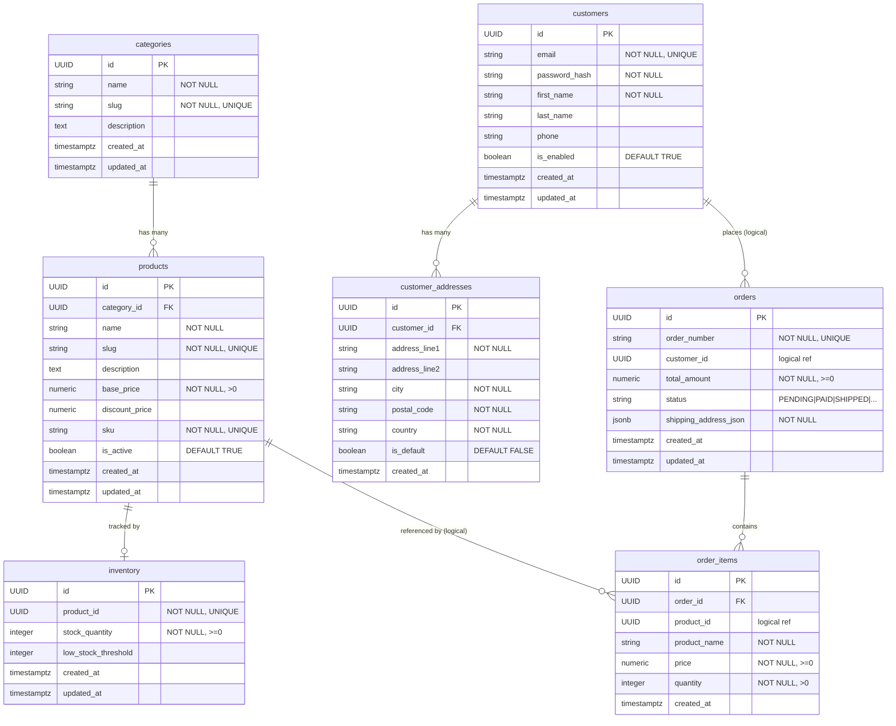
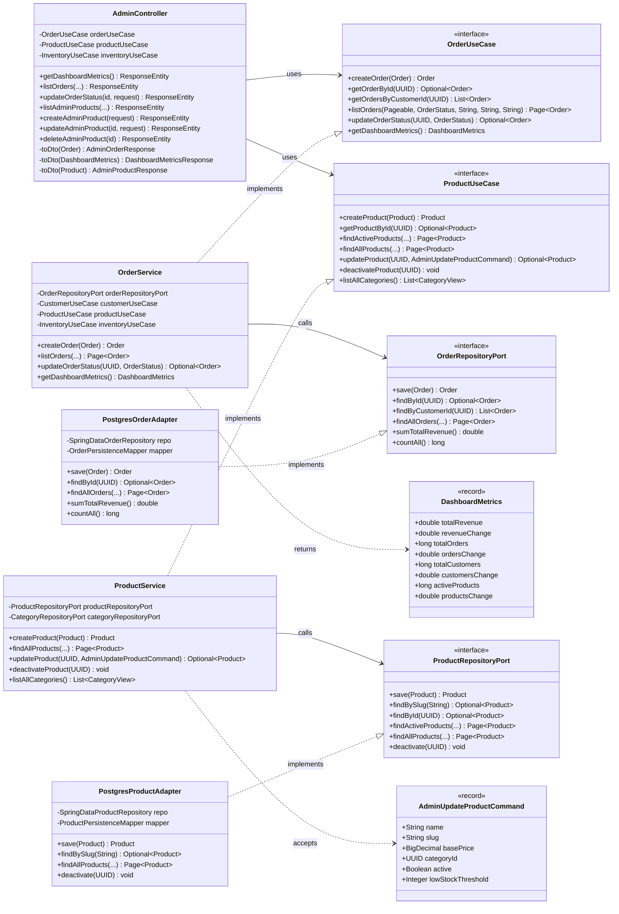

# UML Diagrams — Bazario E-Commerce Platform

> **Notation:** All diagrams use [Mermaid.js](https://mermaid.js.org/) syntax and render natively in GitHub, GitLab, and JetBrains IDEs.

---

## Table of Contents

1. [Entity Relationship Diagram (ERD)](#entity-relationship-diagram-erd)
2. [Hexagonal Architecture — Class Diagram (Admin/Orders Module)](#hexagonal-architecture--class-diagram-adminorders-module)
3. [Sequence Diagram — Admin Authentication & Order Status Update](#sequence-diagram--admin-authentication--order-status-update)

---

## Entity Relationship Diagram (ERD)

Shows all PostgreSQL tables, their columns, data types, and relationships across the four bounded contexts.

---

## Hexagonal Architecture — Class Diagram (Admin/Orders Module)

Illustrates the strict dependency flow from the Web Adapter inward through the Inbound Port, Domain Service, Outbound Port, and finally to the Persistence Adapter. No arrows point outward from the domain.

---

## Sequence Diagram — Admin Authentication & Order Status Update

Shows the complete end-to-end request-response flow: an administrator logs in via the Admin Portal, receives a JWT, and then uses that token to update an order's status through the backend.

```mermaid
sequenceDiagram
    autonumber

    actor Admin as Admin User (Browser)
    participant NextAdmin as Next.js Admin Portal<br/>(apps/admin)
    participant AuthCtrl as AuthController<br/>(POST /api/v1/auth/login)
    participant AuthSvc as AuthService<br/>(Domain Service)
    participant CustomerRepo as CustomerRepositoryPort<br/>(PostgresCustomerAdapter)
    participant DB as PostgreSQL
    participant AdminCtrl as AdminController<br/>(PATCH /api/v1/admin/orders/{id}/status)
    participant SecFilter as Spring Security<br/>(JWT Filter)
    participant OrderSvc as OrderService<br/>(Domain Service)
    participant OrderRepo as OrderRepositoryPort<br/>(PostgresOrderAdapter)

    %% ── Phase 1: Authentication ──────────────────────────────────────────────
    rect rgb(15, 25, 50)
        Note over Admin, DB: Phase 1 — Admin Authentication
        Admin->>NextAdmin: Enter email + password → click "Authenticate Access"
        NextAdmin->>AuthCtrl: POST /api/v1/auth/login<br/>{ "email": "admin@bazario.com", "password": "••••••" }
        AuthCtrl->>AuthSvc: authenticate(email, password)
        AuthSvc->>CustomerRepo: findByEmail(email)
        CustomerRepo->>DB: SELECT * FROM customers WHERE email = ?
        DB-->>CustomerRepo: CustomerJpaEntity row
        CustomerRepo-->>AuthSvc: Customer domain object
        AuthSvc->>AuthSvc: BCrypt.verify(password, passwordHash)
        AuthSvc->>AuthSvc: assertRole(customer, ROLE_ADMIN)
        AuthSvc->>AuthSvc: JwtService.generateToken(customer)
        AuthSvc-->>AuthCtrl: AuthResult { accessToken, refreshToken, expiresIn }
        AuthCtrl-->>NextAdmin: 200 OK<br/>{ "accessToken": "eyJ...", "expiresIn": 3600 }
        NextAdmin->>NextAdmin: localStorage.setItem("admin_token", accessToken)
        NextAdmin-->>Admin: Dashboard rendered ✓
    end

    %% ── Phase 2: Order Status Update ─────────────────────────────────────────
    rect rgb(10, 30, 20)
        Note over Admin, DB: Phase 2 — Update Order Status
        Admin->>NextAdmin: Select order → change status to "SHIPPED" → confirm
        NextAdmin->>AdminCtrl: PATCH /api/v1/admin/orders/{orderId}/status<br/>Authorization: Bearer eyJ...<br/>{ "status": "SHIPPED" }
        AdminCtrl->>SecFilter: Intercept request
        SecFilter->>SecFilter: JwtService.validateToken(token)
        SecFilter->>SecFilter: Extract claims → ROLE_ADMIN confirmed
        SecFilter-->>AdminCtrl: SecurityContext populated ✓
        AdminCtrl->>AdminCtrl: @PreAuthorize("hasRole('ADMIN')") passes
        AdminCtrl->>AdminCtrl: OrderStatus.valueOf("SHIPPED")
        AdminCtrl->>OrderSvc: updateOrderStatus(orderId, SHIPPED)
        OrderSvc->>OrderRepo: findById(orderId)
        OrderRepo->>DB: SELECT * FROM orders WHERE id = ?
        DB-->>OrderRepo: OrderJpaEntity row
        OrderRepo-->>OrderSvc: Order domain object
        OrderSvc->>OrderSvc: order.setStatus(SHIPPED)
        OrderSvc->>OrderSvc: order.setUpdatedAt(now())
        OrderSvc->>OrderRepo: save(order)
        OrderRepo->>DB: UPDATE orders SET status = 'SHIPPED', updated_at = now() WHERE id = ?
        DB-->>OrderRepo: Updated row
        OrderRepo-->>OrderSvc: Updated Order domain object
        OrderSvc-->>AdminCtrl: Optional<Order> (present)
        AdminCtrl->>AdminCtrl: toDto(order) → AdminOrderResponse
        AdminCtrl-->>NextAdmin: 200 OK<br/>{ "id": "...", "status": "SHIPPED", "updatedAt": "..." }
        NextAdmin-->>Admin: Order row updated in UI ✓
    end
```

